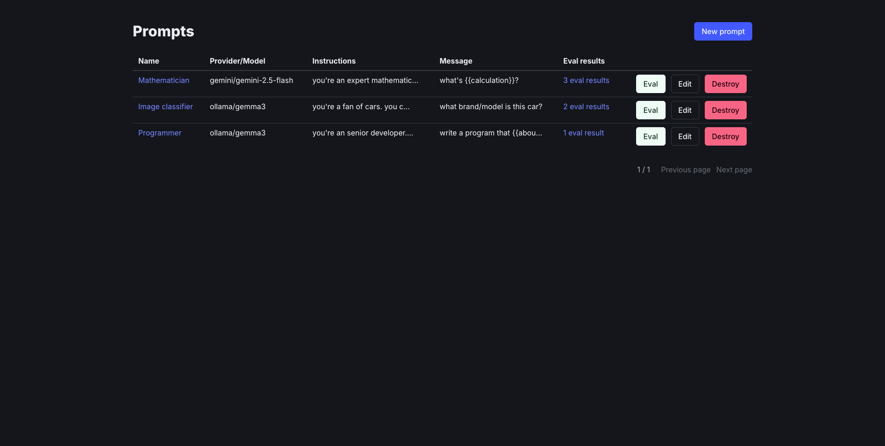
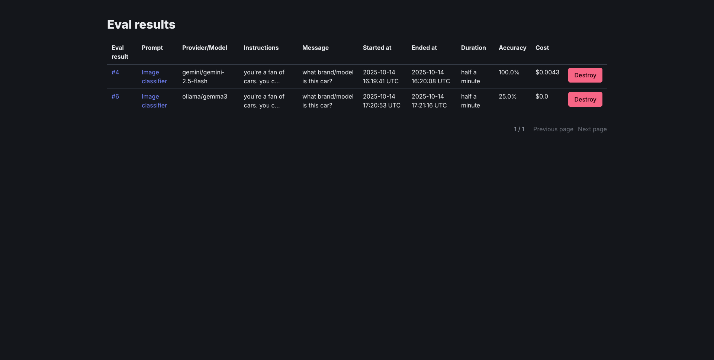
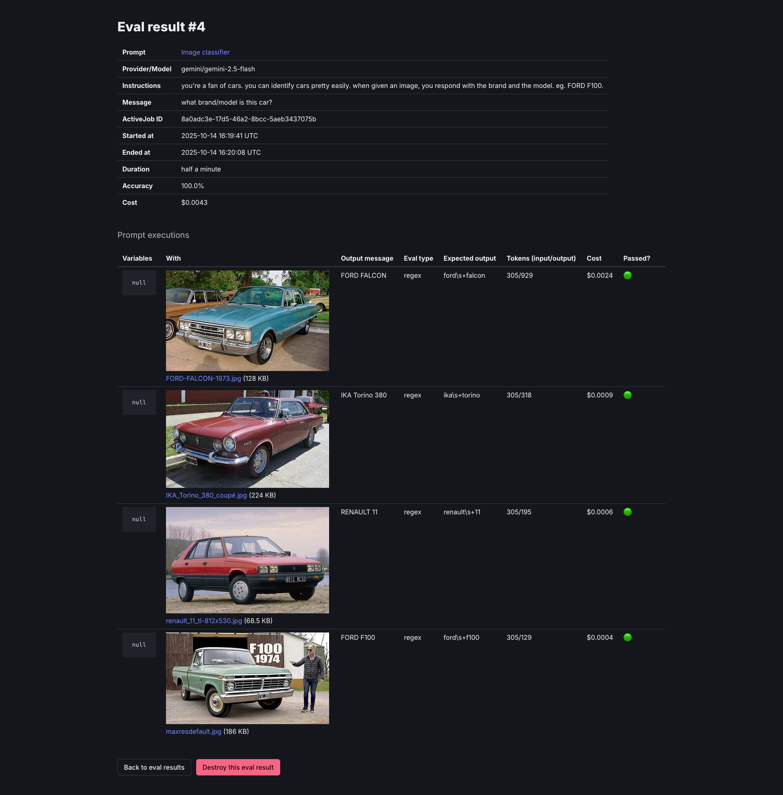

# PromptBench

Test, compare, and improve your LLM prompts within your Rails application.

## Installation

> [!NOTE]
> This engine relies on ActiveJob, ActiveStorage, and [RubyLLM](https://github.com/crmne/ruby_llm). Make sure you have them installed and configured.

Add this line to your application's Gemfile:

```ruby
gem "prompt_bench"
```

And then execute:

```bash
$ bundle
$ rails g prompt_bench:install
```

This will create the migrations for the PromptBench models. So make sure you run:

```bash
$ rails db:migrate
```

And then mount the engine in your `config/routes.rb`:

```ruby
Rails.application.routes.draw do
  # ...

  mount PromptBench::Engine, at: "/prompt_bench"
end
```

Now you should be able to browse to `/prompt_bench/` and create, test, compare, and improve your LLM prompts. Continue reading to see out how a typical workflow looks like, and how you can leverage your app's data to add eval examples to your prompts.





## Configuration

### Authentication and authorization

PromptBench leaves authentication and authorization to the user. If no authentication is enforced, `/prompt_bench` will be available to everyone.

By default, PromptBench controllers inherit from the host app's `ApplicationController`. So if you implemented authentication and authorization in your `ApplicationController` you're all set. However, if you need to change the base class of the controller (for example if you want to restrict access to admin users), you need to set the `base_controller_class`:

```ruby
# in config/initializers/prompt_bench.rb

PromptBench.configure do |config|
  config.base_controller_class = "AdminController"
end
```

## Usage

### Workflow

A typical workflow looks like this:

#### Create a prompt

A prompt represents an LLM prompt template with:

* Provider: see [available providers](https://github.com/crmne/ruby_llm/tree/main/lib/ruby_llm/providers)
* Model: see [available models](https://github.com/crmne/ruby_llm/blob/main/lib/ruby_llm/models.json). In case you're selecting a local provider (eg. Ollama), you can enter the model name in a text field.
* Instructions: optional, the system prompt.
* Message: message template.
* Temperature: optional, controls randomness (0.0 to 1.0). Lower values make output more focused and deterministic.
* Params: optional, additional provider-specific parameters as JSON (e.g., `{"max_tokens": 1000}`).
* Tools: optional, array of tool class names that the LLM can use (e.g., `["Weather", "Calculator"]`). See how tools are defined in [RubyLLM](https://rubyllm.com/tools/).

Both the instructions and the message template can contain variables that will be replaced at runtime. To add variables, enclose them with braces. Eg: `{{name}}`.

> [!NOTE]
> In order to use a provider, you must have it configured in `config/initializer/ruby_llm.rb` as explained [here](https://rubyllm.com/configuration/#provider-configuration)

#### Add eval examples

When creating/editing a prompt you can add eval examples, where you can define:

* Variables: a JSON that contains the values to use when executing the prompt. Eg: `{ "name": "Patricio" }`
* Eval type: the evaluation criteria: exact match, contains, regex, or human review.
* Expected output: optional if the eval type is `human`
* Files: optional attachments.

#### Run evaluations

Once you have a prompt with its examples you can run the evaluations. This will enqueue a job that will create an eval result and run each eval example with the current prompt configuration.

The eval result will save the current prompt configuration for later analysis, such as the current provider/model, instructions, messages, variables, etc.

#### Analyze the results

You can view the accuracy, cost, and duration of the entire eval result and each individual prompt execution.

If you chose the human review eval type, it's now that you can review if an eval passed or not.

### Beyond a typical workflow

#### Using your data to create prompts/eval examples

Suppose you want to categorize images. You can have a prompt (eg. `image-categorization`) and then add your data to the eval set:

```ruby
prompt = PromptBench::Prompt.find_by slug: "image-categorization"

Image.where(category: nil).take(50).each do |image|
  eval_example = prompt.eval_examples.create eval_type: :human
  eval_example.files.attach image.attachment.blob
end
```

Then you iterate over the prompt trying to find the best configuration possible.

#### Using the prompt

Once you've tested and refined your prompt, you can use it in your application code.

##### Execute prompts by slug

Execute prompts by their slug to get a response object with content and metadata:

```ruby
# Simple execution without variables
response = PromptBench::Prompt.execute("image-categorization")
response.content  # => "landscape"

# With variables
response = PromptBench::Prompt.execute(
  "text-summarization",
  variables: { "text" => "Long article content here..." }
)
response.content  # => "Brief summary of the article"

# With file attachments
response = PromptBench::Prompt.execute(
  "image-categorization",
  files: [image.attachment.blob]
)
response.content  # => "person"

# Access token counts and metadata
response = PromptBench::Prompt.execute(
  "sentiment-analysis",
  variables: { "text" => "I love this product!" }
)
response.content        # => "positive"
response.input_tokens   # => 25
response.output_tokens  # => 3
```

You can also execute a prompt directly on a Prompt instance:

```ruby
prompt = PromptBench::Prompt.find_by(slug: "sentiment-analysis")
response = prompt.execute(variables: { "text" => "I love this product!" })
response.content  # => "positive"
```

## Contributing

You can open an issue or a PR in GitHub.

## License

The gem is available as open source under the terms of the [MIT License](https://opensource.org/licenses/MIT).
